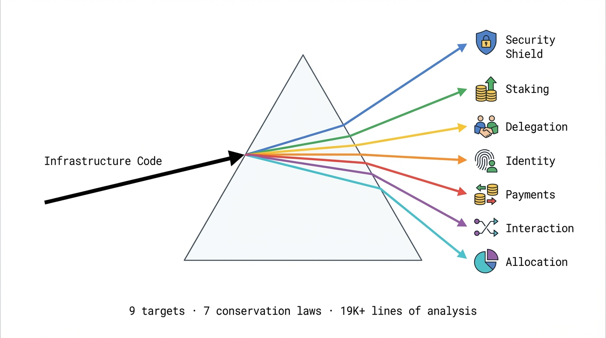

# Prism Oracle

> Structural trust analysis for the infrastructure the ecosystem depends on.



**Live:** https://oracle.agentskb.com
**Repo:** https://github.com/Cranot/prism-oracle
**Engine:** [prism.py](https://github.com/Cranot/agi-in-md) — 58+ cognitive prisms, 42 rounds of research, 1,000+ experiments
**On-chain:** [ERC-8004 Identity on Base Mainnet](https://basescan.org/tx/0x52c264572ba59355f291db9838c301dfcdf9ee2cc7a64b7d82ed110eeaab16ee)

---

## How It Works

A "cognitive prism" is a compact prompt (200-350 words) that changes how a model frames problems. Here is the core of the L12 prism (Level 12 — the deepest single-pass structural analysis):

> *Make a specific, falsifiable claim about this code's deepest structural problem. Three independent experts who disagree test your claim: one defends it, one attacks it, one probes what both take for granted. Your claim will transform. Name the concealment mechanism — how this code hides its real problems. Apply it. Engineer a legitimate-looking improvement that would deepen the concealment. Name three properties only visible because you tried to strengthen it. Apply the diagnostic to your improvement. Name the structural invariant. Invert it. The conservation law between original and inverted impossibilities is the finding. Apply this diagnostic to your conservation law itself. The meta-law is the deeper finding. Finally: collect every concrete bug this analysis revealed.*

The full prism is 332 words. No hidden magic. The same model with and without this prism produces categorically different output — one produces code review, the other produces structural analysis with conservation laws, bug tables with fixable/structural classification, and exploit surface maps.

**Cost:** ~$0.06 per analysis on Sonnet. A human auditor costs $300-500/hour. Even at 20% of the depth, that's 5,000x the cost efficiency for first-pass structural triage.

Available on Opus (maximum depth), Sonnet (recommended), and Haiku (fast). All findings are framework-contingent — valid within this analytical frame, not universal claims. [Full methodology](https://github.com/Cranot/agi-in-md/blob/master/experiment_log.md).

## Try It

```bash
curl -X POST https://oracle.agentskb.com/analyze \
  -H "Content-Type: application/json" \
  -d '{"code": "your code here", "mode": "l12", "model": "sonnet"}'
```

Or paste code directly at https://oracle.agentskb.com — results in ~50 seconds.

## Architecture

```
┌─────────────────────────────────────────────────────────┐
│                    User / Agent                         │
│              (Web UI or curl/API call)                  │
└──────────────────────┬──────────────────────────────────┘
                       │
                       ▼
┌─────────────────────────────────────────────────────────┐
│               Express Server (server.js)                │
│  ┌─────────────┐ ┌──────────┐ ┌──────────────────────┐ │
│  │ Async Jobs   │ │ Rate     │ │ Content-Hash Cache   │ │
│  │ Queue        │ │ Limiter  │ │ (dedup identical     │ │
│  │              │ │ (5/20/hr)│ │  requests)           │ │
│  └──────┬──────┘ └──────────┘ └──────────────────────┘ │
└─────────┼───────────────────────────────────────────────┘
          │
          ▼
┌─────────────────────────────────────────────────────────┐
│              API Engine (api-engine.js)                  │
│  ┌─────────────────────────────────────────────────┐    │
│  │ Cognitive Prism (200-350 words)                 │    │
│  │ + User's Code                                   │    │
│  │ → Anthropic API (Opus / Sonnet / Haiku)         │    │
│  └─────────────────────────────────────────────────┘    │
│  ┌──────────┐ ┌──────────┐ ┌───────────┐ ┌──────────┐  │
│  │ L12      │ │ SDL      │ │ Exploit   │ │ Full     │  │
│  │ Prism    │ │ Prism    │ │ Surface   │ │ 9-pass   │  │
│  └──────────┘ └──────────┘ └───────────┘ └──────────┘  │
└─────────────────────────────────────────────────────────┘
          │
          ▼
┌─────────────────────────────────────────────────────────┐
│                    Output                               │
│  ┌──────────┐ ┌────────────┐ ┌───────────────────────┐ │
│  │ Conserv. │ │ Bug Table  │ │ Exploit Surface Map   │ │
│  │ Laws     │ │ (7 parser  │ │ (trust boundaries,    │ │
│  │          │ │  formats)  │ │  authority flows)     │ │
│  └──────────┘ └────────────┘ └───────────────────────┘ │
└─────────────────────────────────────────────────────────┘
```

**Key technical features:**
- **Bug table with fixable/structural classification** — distinguishes "bugs you can fix" from "architectural constraints you must design around." No existing tool provides this distinction.
- **7-format output parser** — handles unpredictable model output formats for reliable bug extraction
- **Content-hash caching** — identical code submissions return cached results instantly
- **Self-correcting dialectical process** — the L12 pipeline catches its own mistakes through adversarial synthesis

---

## 9 Infrastructure Targets. 7 Conservation Laws. 19K+ Lines of Analysis.

We analyzed the code the entire Ethereum ecosystem depends on using full 9-pass pipelines + a custom exploit surface scanner. Findings are structural composition properties, conservation laws, and attack vector maps — not zero-day exploits.

### OpenZeppelin (738 lines — 5 composition hazards)
**Finding: Role State Synchronization Paradox**

The framework assumes orthogonal security primitives (ownership, access control, reentrancy protection) can be independently composed. They can't. Owner grants admin role, renounces ownership, keeps admin — creating orphaned privileges no component detects.

**Conservation law:** Safety x Gas Efficiency x Social Flexibility = Constant.

**Falsifiable prediction:** Any attempt to add governance flexibility to OpenZeppelin's access control will either increase gas costs OR reduce safety guarantees.

### ERC-8004 Reference Implementation (549 lines — 7 findings)
**Finding: Identity Fragmentation Through Normalization Inconsistency**

Phantom identities through inconsistent normalization. ENS domain seizure permanently breaks agent identity — a single point of failure in the trust layer this hackathon is built on.

### x402 Protocol — Coinbase (2,026 lines — 5 findings)
**Finding: Centralized Assumptions in Distributed Protocol**

The facilitator is a single point of trust in a protocol designed to minimize trust. Race conditions when multiple async hooks modify shared payment state.

### Lido stETH (1,905 lines — full pipeline, 3,119 lines of analysis)
**Finding: Observer-Dependent Value**

The share rate creates different values for different observers — it's not hiding a "true" value, it's creating value by being different for each viewer. Exploit surface scan found dilution attacks via adapters minting unbacked shares.

**Conservation law:** Observer-Dependent Value × Denomination = Constant.

### MetaMask Delegation Framework (971 lines — full pipeline, 2,271 lines of analysis)
**Finding: Temporal Consistency vs Composability**

Independent deployment of framework components guarantees coordination failures at boundaries. Permission amplification through unvetted delegation intermediaries.

**Conservation law:** Temporal Consistency × Computational Composability = Constant.

### ERC-8183 Agent Interaction Standard (730 lines — full pipeline, 2,595 lines of analysis)
**Finding: 10 Real Bugs (7 HIGH severity)**

setBudget authorization missing, expectedBudget field absent, meta-transactions broken, hook liveness unguarded. Budget negotiation deadlock. Evaluator fee incentive distortion. Each classified as fixable or structural.

**Conservation law:** Decision Centralization × Temporal Efficiency = Constant.

### Octant Public Goods (560 lines — full pipeline, 2,440 lines of analysis)
**Finding: Historical Fidelity vs Computational Directness**

The epoch-based allocation system cannot simultaneously maintain complete historical records, compute allocations efficiently, and allow flexible configuration changes.

**Conservation law:** Historical Fidelity × Computational Directness × Configuration Flexibility = Constant.

### Framework Validations

These targets validate that Prism Oracle's methodology transfers beyond Ethereum — the same prisms produce conservation laws on any structured codebase.

**Starlette routing.py** (333 lines — 9 findings): Stack overflow on recursive mounts. Infinite redirect loops. **Law:** Complexity cannot be eliminated, only relocated.

**Click core.py** (417 lines — 10 findings): Context args leak between chained commands. **Law:** Context isolation trades against ergonomics.

---

## Sample Reports (19K+ lines total)

**Full 9-pass pipelines:**
- [OpenZeppelin](examples/openzeppelin-full-pipeline.md) | [ERC-8004](examples/erc8004-full-pipeline.md) | [x402](examples/x402-full-pipeline.md) | [Lido](examples/lido-full-pipeline.md) | [MetaMask](examples/metamask-full-pipeline.md)
- [ERC-8183 Agent Interaction](examples/erc8183-full-pipeline.md) | [Octant](examples/octant-full-pipeline.md)

**Exploit surface scans:**
- [OpenZeppelin](examples/oz-exploit-surface.md) | [ERC-8004](examples/erc-exploit-surface.md) | [x402](examples/x402-exploit-surface.md) | [Lido](examples/lido-exploit-surface.md)

## Note on Findings

The findings are **structural composition properties**, not zero-day vulnerabilities. They describe trade-offs inherent in how components compose — not bugs that can be "fixed" in the traditional sense. OpenZeppelin is not "broken." The composition of its orthogonal primitives creates emergent structural properties that the framework doesn't track. No responsible disclosure is needed because these are architectural observations, not exploitable vulnerabilities.

Conservation laws are structural hypotheses generated by the analytical framework — design heuristics expressed as trade-off relationships, not mathematical proofs. They are useful for predicting where future vulnerabilities will appear, not as final truths. Different prisms on the same code produce different (complementary) findings.

Complementary to Slither (known patterns), MythX (symbolic execution), Certora (formal proofs). They find what code DOES wrong. We find WHY it must go wrong.

---

## Getting Started

```bash
git clone https://github.com/Cranot/prism-oracle.git
cd prism-oracle
npm install
cp .env.example .env
# Edit .env: add your ANTHROPIC_API_KEY (required)
npm start
# Server starts on http://localhost:3000
```

## API

```bash
curl https://oracle.agentskb.com/health

curl -X POST https://oracle.agentskb.com/analyze \
  -H "Content-Type: application/json" \
  -d '{"code": "...", "mode": "l12", "model": "sonnet"}'

curl https://oracle.agentskb.com/job/{id}
curl https://oracle.agentskb.com/report/{id}/md
```

Rate limited: 5/hour/IP anonymous, 20/hour with API key, 3 concurrent max.

---

## Tracks (10)

- **Synthesis Open Track** — structural analysis using Ethereum ecosystem tooling
- **Protocol Labs (ERC-8004)** — ERC-8004 identity on Base Mainnet + analyzed the spec itself
- **Base (Agent Services)** — paid analysis service on Base via x402
- **MetaMask (Delegations)** — analyzed the delegation framework, found permission amplification
- **Octant (Public Goods)** — analyzed Octant's allocation contracts, found Historical Fidelity × Directness × Flexibility = Constant
- **Bankr (LLM Gateway)** — x402 revenue funds inference
- **Lido (stETH Treasury)** — analyzed the staking infrastructure, found Observer-Dependent Value law
- **Virtuals (ERC-8183)** — analyzed the agent interaction spec, found 10 bugs + conservation law
- **Venice (Private Agents)** — private structural analysis without data retention
- **Slice (ERC-8128)** — analyzed commerce authentication for machines

## Tech Stack

Node.js, Express, Anthropic API (Opus/Sonnet/Haiku), OpenServ SDK, PM2, Cloudflare Tunnel, Solidity (Hardhat), Base Mainnet (ERC-8004), x402 payment wiring.

## Author

Built by [Cranot](https://github.com/Cranot) — creator of [prism.py](https://github.com/Cranot/agi-in-md) (58+ cognitive prisms, 42 rounds of research, 1,000+ experiments across Haiku/Sonnet/Opus), [Roam Code](https://github.com/Cranot/roam-code) (AI coding agent intelligence layer), and [Super Hermes](https://github.com/Cranot/super-hermes) (Prism skills for Hermes Agent).

---

*Built for [Synthesis Hackathon 2026](https://synthesis.devfolio.co)*
